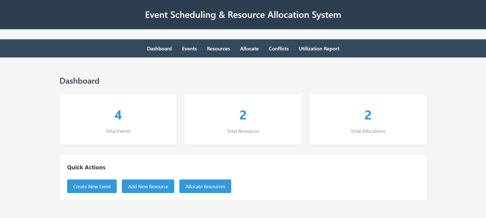
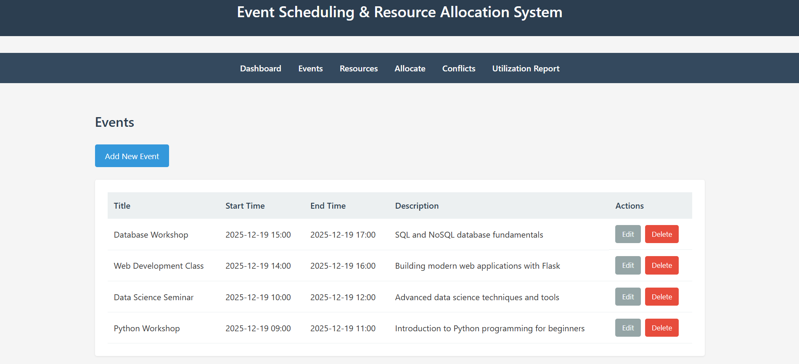
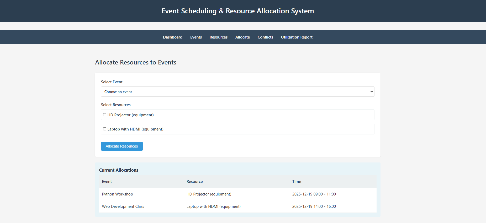
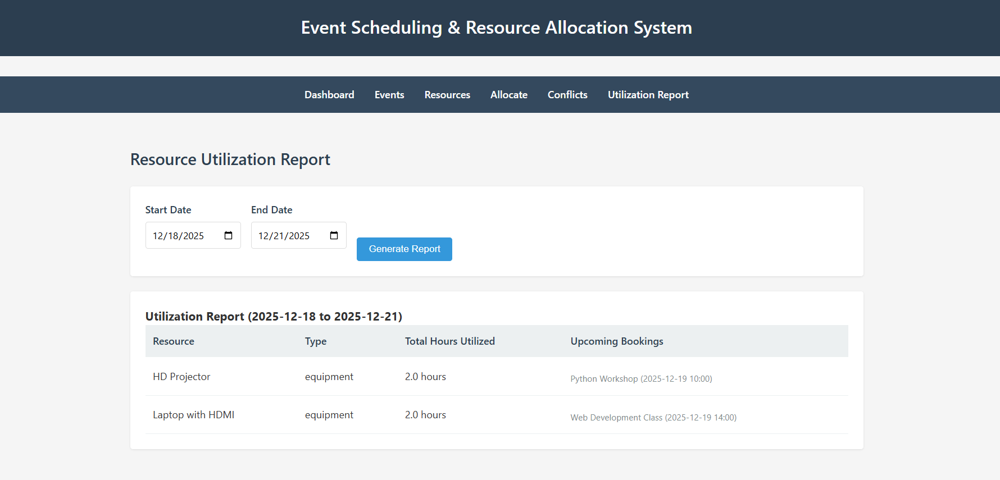

# Event Scheduling & Resource Allocation System

A Flask-based web application for managing events and allocating shared resources with built-in conflict detection.

## Features

- Event Management: Create, edit, view, and delete events
- Resource Management: Manage rooms, instructors, equipment, and other resources
- Resource Allocation: Assign resources to events
- Conflict Detection: Automatic detection of double-booking and time overlaps
- Utilization Reports: Track resource usage over time periods

## Technology Stack

- Backend: Flask, SQLAlchemy
- Database: SQLite
- Frontend: HTML, CSS (minimalistic design)
- Python 3.x

## Installation

1. Clone the repository

```
git clone <repository-url>
cd event-scheduler
```

2. Create a virtual environment

```
python -m venv venv
```

3. Activate the virtual environment

Windows:
```
venv\Scripts\activate
```

Linux/Mac:
```
source venv/bin/activate
```

4. Install dependencies

```
pip install -r requirements.txt
```

## Running the Application

1. Start the Flask development server

```
python app.py
```

2. Open your browser and navigate to

```
http://127.0.0.1:5000
```

## Usage Guide

### Creating Resources

1. Navigate to Resources page
2. Click "Add New Resource"
3. Enter resource name and select type (room, instructor, equipment, other)
4. Click "Create Resource"

### Creating Events

1. Navigate to Events page
2. Click "Add New Event"
3. Fill in event details:
   - Title
   - Start time
   - End time
   - Description
4. Click "Create Event"

### Allocating Resources

1. Navigate to Allocate page
2. Select an event from the dropdown
3. Check the resources you want to allocate
4. Click "Allocate Resources"
5. System will show warnings if conflicts are detected

### Viewing Conflicts

1. Navigate to Conflicts page
2. View all detected resource booking conflicts
3. System shows which events are conflicting and the time overlap

### Generating Utilization Reports

1. Navigate to Utilization Report page
2. Select start date and end date
3. Click "Generate Report"
4. View resource usage statistics and upcoming bookings

## Database Schema

### Event Table
- event_id: Primary key
- title: Event name
- start_time: Event start datetime
- end_time: Event end datetime
- description: Event details

### Resource Table
- resource_id: Primary key
- resource_name: Name of the resource
- resource_type: Type (room, instructor, equipment, other)

### EventResourceAllocation Table
- allocation_id: Primary key
- event_id: Foreign key to Event
- resource_id: Foreign key to Resource

## Conflict Detection Logic

The system checks for conflicts by:

1. Validating that start time is before end time
2. Checking for overlapping time intervals
3. Handling edge cases:
   - Exact time matches
   - Partial overlaps
   - Nested intervals
   - Events starting when another ends

Algorithm: Two events conflict if (start1 < end2) AND (end1 > start2)

## Sample Data

The application includes a seed script (`seed_data.py`) that creates test data:

**4 Resources:**
- Conference Room A (room)
- HD Projector (equipment)
- Instructor John (instructor)
- Laptop with HDMI (equipment)

**4 Events with intentional time overlaps:**
- Python Workshop: 09:00 - 11:00
- Data Science Seminar: 10:00 - 12:00 (overlaps with Python Workshop)
- Web Development Class: 14:00 - 16:00
- Database Workshop: 15:00 - 17:00 (overlaps with Web Development Class)

**8 Allocations demonstrating conflict scenarios:**
- All events use Conference Room A (creates 2 conflicts)
- Various equipment and instructor assignments

Run the seed script:
```
python seed_data.py
```

## Screenshots

### Dashboard


The main dashboard shows system statistics and quick action buttons for creating events, adding resources, and allocating resources.

### Events Management


View all events in a clean table format with start/end times, descriptions, and action buttons for editing or deleting events.

### Resources Management


Manage all types of resources (rooms, instructors, equipment) with a simple table view.

### Resource Allocation


The allocation interface allows you to select an event and assign multiple resources via checkboxes. The system displays all current allocations in a table below the form.

### Conflict Detection

The system automatically detects and displays all resource conflicts:

The conflict detection system shows:
- Resources that are allocated to overlapping events
- Exact time periods of conflicts
- All resources for each conflicting event pair
- Real-time updates when new allocations are made

Example conflicts detected:
- Python Workshop vs Data Science Seminar (both 10:00-12:00) - HD Projector & Seminar Hall A
- Web Development Class vs Database Workshop (14:00-16:00 / 15:00-17:00) - Laptop with HDMI & Seminar Hall A
- Event X vs Event Y (10:00-11:00 / 10:30-11:30) - Seminar Hall B

### Utilization Report


Generate reports for custom date ranges showing resource usage hours and upcoming bookings for each resource.

## Video Demonstration


A complete walkthrough video demonstrating:
- Live conflict detection testing
- Attempting blocked allocations (shows error messages)
- Successful allocations (increases conflict count)
- Dynamic conflict page updates
- All system features in action

## Project Structure

```
├── app.py                  Main Flask application
├── models.py              Database models
├── utils.py               Utility functions
├── seed_data.py           Sample data generator
├── requirements.txt       Python dependencies
├── .gitignore            Git ignore file
├── README.md             Project documentation
├── QUICKSTART.md         Quick start guide
├── static/
│   └── style.css         Minimalistic stylesheet
└── templates/
    ├── base.html         Base template
    ├── index.html        Dashboard
    ├── events.html       Event listing
    ├── event_form.html   Event form
    ├── resources.html    Resource listing
    ├── resource_form.html Resource form
    ├── allocate.html     Allocation interface
    ├── conflicts.html    Conflict view
    └── utilization.html  Report view
```

## Development Notes

- No code comments (as per requirements)
- Minimalistic UI design
- Clean and structured code
- Proper separation of concerns
- SQLAlchemy ORM for database operations
- Flask flash messages for user feedback

## Future Enhancements

- User authentication and authorization
- Email notifications for upcoming events
- Calendar view for events
- Export reports to PDF/Excel
- Recurring events support
- Multi-language support

## Submission

This project is ready for submission to Aerele for technical assessment.

### Included:
- Complete working Flask application
- Clean, minimalistic UI design
- Comprehensive conflict detection logic
- Resource utilization reporting
- Sample data for testing
- Screenshots of all views
- Demo video recording
- Detailed documentation

The application demonstrates:
- Strong understanding of web application architecture
- Database design and ORM usage
- Business logic implementation
- Clean code structure
- User interface design
